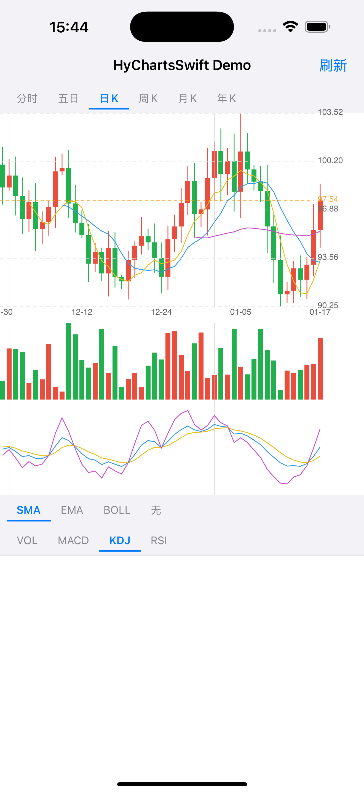
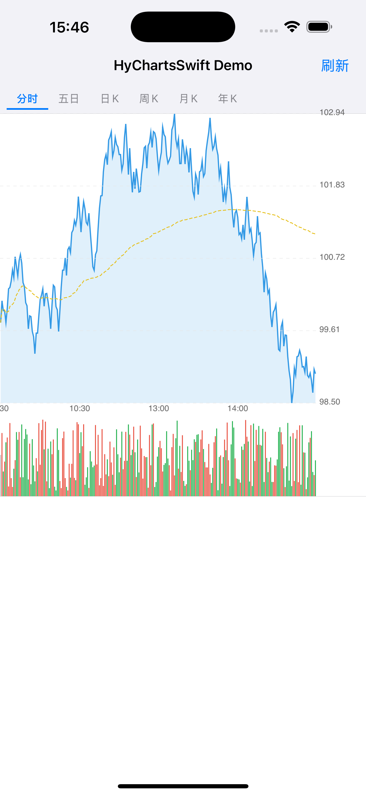

# HyChartsSwift

A high-performance, protocol-oriented Swift K-line & time-sharing chart library for iOS.  
Rewritten from [HyCharts](https://github.com/hydreamit/HyCharts) (OC version), drawing on real trading app experience.

English | [中文](README_CN.md)

---

　

---

## Features

- **K-line chart** — candlesticks with pan & pinch-zoom, period separator lines
- **Time-sharing chart** — filled area chart with average-price line, 5-day view
- **Main-chart overlays** — SMA, EMA, Bollinger Bands (switchable)
- **Auxiliary panel** — Volume / MACD / KDJ / RSI (switchable)
- **Period support** — minute / daily / weekly / monthly / yearly K-lines
- **Protocol-oriented** — implement `KLineModel` or `TimeShareModel` on your own data struct
- **60 fps rendering** — CALayer pipeline, merged CGPath per color group
- **Thread-safe** — indicator computation via Swift `actor`

---

## Requirements

| | Minimum |
|---|---|
| iOS | 15.0 |
| Swift | 5.9 |
| Xcode | 15.0 |

---

## Installation

### Swift Package Manager

Add to your `Package.swift`:

```swift
dependencies: [
    .package(url: "https://github.com/yuanshipei/HyChartsSwift.git", from: "1.0.0")
]
```

Or in Xcode: **File → Add Package Dependencies** → paste the repo URL.

### CocoaPods

```ruby
pod 'HyChartsSwift', '~> 1.0'
```

Then run:

```bash
pod install
```

---

## Quick Start

### 1. Implement the data protocol

```swift
import HyChartsSwift

struct MyKLine: KLineModel {
    var open:      Double
    var high:      Double
    var low:       Double
    var close:     Double
    var volume:    Double
    var xLabel:    String   // e.g. "01-05"
    var timestamp: Date?    // for period separator lines
}
```

### 2. Add the chart view

```swift
import HyChartsSwift

let chart = KLineChartView()
view.addSubview(chart)
chart.frame = CGRect(x: 0, y: 0, width: view.bounds.width, height: 460)

// Configure
var config = KLineConfiguration()
config.mainTechnical = .ema(periods: [5, 10, 30])
config.auxiliaryType = .macd()
config.chartPeriod   = .daily
chart.configuration  = config

// Load data
chart.load(ArrayDataSource(myKLines))
```

### 3. Time-sharing chart

```swift
struct MyTick: TimeShareModel {
    var price:     Double
    var average:   Double?  // average price line
    var volume:    Double
    var xLabel:    String   // e.g. "9:30"
    var timestamp: Date?
}

let tsChart = TimeShareChartView()
tsChart.load(myTicks, dayCount: 1)   // dayCount: 5 for 5-day view
```

---

## Configuration

`KLineConfiguration` is a value type — mutate it and assign back to trigger a redraw.

```swift
var config = KLineConfiguration()

// Colors
config.upColor   = UIColor(red: 0.91, green: 0.30, blue: 0.24, alpha: 1)
config.downColor = UIColor(red: 0.13, green: 0.69, blue: 0.30, alpha: 1)

// Layout
config.yAxisWidth           = 60
config.volumeHeightRatio    = 0.20
config.auxiliaryHeightRatio = 0.25

// Indicators
config.mainTechnical = .boll(period: 20, multiplier: 2.0)
config.auxiliaryType = .kdj()
config.chartPeriod   = .weekly

// Time-sharing colors
config.timeShareLineColor    = .systemBlue
config.timeShareAvgLineColor = .systemYellow
```

### MainTechnicalType

```swift
.none
.sma(periods: [5, 10, 30])
.ema(periods: [5, 10, 30])
.boll(period: 20, multiplier: 2.0)
```

### AuxiliaryType

```swift
.volume
.macd(fast: 12, slow: 26, signal: 9)
.kdj(n: 9, m1: 3, m2: 3)
.rsi(periods: [6, 12, 24])
```

### ChartPeriod

```swift
.minute(1)   // intraday — separator = each trading day
.daily       // separator = first trading day of each month
.weekly      // separator = first week of each quarter
.monthly     // separator = January of each year
.yearly      // separator = every 5 years
```

---

## Real-time Updates

```swift
// Append new candles (e.g. after a REST poll)
chart.appendModels(newCandles)

// Tick update — update the last candle in place
chart.updateLastModel(latestCandle)
```

---

## Architecture

```
KLineModel (your data)
    ↓  ArrayDataSource / custom ChartDataSource
ChartDataStore (actor)          — thread-safe model storage & indicator cache
    ↓  async
CoordinateMapper (value type)  — price/volume/index ↔ pixel, no side effects
    ↓
CALayer pipeline
    ├── KLineMainLayer          — candles + SMA/EMA/BOLL lines
    ├── KLineVolumeLayer        — volume bars
    ├── KLineAuxiliaryLayer     — MACD / KDJ / RSI
    └── AxisLayer               — grid lines, price labels, time labels
```

---

## Demo

Open `Demo/HyChartsDemoSwift.xcodeproj` and run on a simulator or device.

---

## License

MIT © 2025 yuanshipei  
See [LICENSE](LICENSE) for details.

---

## Acknowledgements

This library is a Swift rewrite of [HyCharts](https://github.com/hydreamit/HyCharts)  
by [@hydreamit](https://github.com/hydreamit), with additional features and architecture  
improvements based on real-world trading app experience for HK & US markets.
